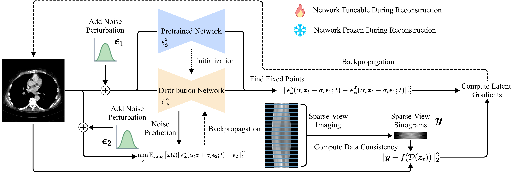

<div align="center">

# Solving Zero-Shot Sparse-View CT Reconstruction With Variational Score Solver

<a href="https://pytorch.org/get-started/locally/"></a>
<a href="https://pytorchlightning.ai/"></a>
<a href="https://hydra.cc/"></a>
<a href="https://github.com/ashleve/lightning-hydra-template"></a><br>
<!-- [](https://www.nature.com/articles/nature14539)
[](https://papers.nips.cc/paper/2020) -->

[IEEE Transactions on Medical Imaging](https://ieeexplore.ieee.org/document/10706876) | [BibTex](#bibtex)

</div>

## Abstract

Computed tomography (CT) stands as a ubiquitous medical diagnostic tool. Nonetheless, the radiation-related concerns associated with CT scans have raised public apprehensions, particularly limiting its utility in intraoperative scenarios. Mitigating radiation dosage in CT imaging poses an inherent challenge as it inevitably compromises the fidelity of CT reconstructions, impacting diagnostic accuracy. While previous deep learning techniques have exhibited promise in enhancing CT reconstruction quality, they remain hindered by the reliance on paired data, which is often arduous to procure. In this study, we present a novel approach named Variational Score Solver (VSS) for solving sparse-view reconstruction without paired data. Specifically, our approach entails the acquisition of a probability distribution from densely sampled CT reconstructions, employing a latent diffusion model. High-quality reconstruction outcomes are achieved through an iterative process, wherein the diffusion model serves as the prior term, subsequently integrated with the data consistency term. Notably, rather than directly employing the prior diffusion model, we distill prior knowledge by identifying the fixed point of the diffusion model. This framework empowers us to exercise precise control over the CT reconstruction process. Moreover, we depart from modeling the reconstruction outcomes as deterministic values, opting instead for a dynamic distribution-based approach. This enables us to achieve more accurate reconstructions utilizing a trainable model. Our approach introduces a fresh perspective to the realm of zero-shot CT reconstruction, circumventing the constraints of supervised learning. Our extensive qualitative and quantitative experiments unequivocally demonstrate that VSS surpasses other contemporary unsupervised and achieves comparable results compared with the most advance supervised methods in sparse-view reconstruction tasks.
<p align="center">
    
</p>

## Updates

### 2024-10

We update the codebase to the latest version of our paper. We now provide a new checkpoint for the LDM model trained on 256x256 Mayo dataset. This new checkpoint can achieve better reconstruction results. ([Google Drive](https://drive.google.com/file/d/1qmSapjncKtyQLjC20YWH02NaA-YWsqhJ/view?usp=sharing))

## Installation

#### Pip

* Pytorch >= 2.0
* Diffusers == 0.27.2
* Transformers == 4.37.2
* [Operator Discretization Library (ODL)](https://github.com/odlgroup/odl)
* [Torch-radon](https://github.com/matteo-ronchetti/torch-radon) (Need to be patched. Patch in: [Helix2fan](https://github.com/faebstn96/helix2fan))

```bash
# clone project
git clone https://github.com/fpsandnoob/vss
cd vss

# [OPTIONAL] create conda environment
conda create -n myenv python=3.10
conda activate myenv

# install pytorch according to instructions
# https://pytorch.org/get-started/

# install requirements
pip install -r requirements.txt
```

## Data

#### Model Checkpoint
From this [Google Drive](https://drive.google.com/file/d/1qmSapjncKtyQLjC20YWH02NaA-YWsqhJ/view?usp=sharing), download the  256x256 LDM checkpoint and put it in ''data/ckpt'' directory.

From this [Google Drive](https://drive.google.com/file/d/14BwMCOtFpREKjY1GqNcrvlrRbvOhhbVo/view?usp=sharing), download the checkpoints (including DDPM for 256x256, LDM for 512x512) and unzip them to ''data/ckpt'' directory. (These checkpoints are used for comparison).

#### Preprocessed Data
From this [Google Drive](https://drive.google.com/file/d/1hZuEn_y_BYPWvjGN2QeyP99JICe7pNtL/view?usp=drive_link), download the preprocessed data and unzip them to ''data/dose'' directory.

<!-- #### Conda

```bash
# clone project
git clone https://github.com/YourGithubName/your-repo-name
cd your-repo-name

# create conda environment and install dependencies
conda env create -f environment.yaml -n myenv

# activate conda environment
conda activate myenv
``` -->

## How to inference

You can run VSS like this

<!-- ```bash
# train on CPU
python src/eval.py experiment=mayo_256_sparse_18_ldm_dlir_reddiff model.im_out_dir=eval_data/mayo_sparse_view_18_vss
python src/eval.py experiment=mayo_256_sparse_32_ldm_dlir_reddiff model.im_out_dir=eval_data/mayo_sparse_view_32_vss
python src/eval.py experiment=mayo_256_sparse_64_ldm_dlir_reddiff model.im_out_dir=eval_data/mayo_sparse_view_64_vss
``` -->

```bash
# Evaluate on GPU
python src/eval.py experiment=mayo_256_sparse_90_ldm_dlir_reddiff_fanbeam_unet_v2 model.im_out_dir=eval_data/mayo_sparse_view_90_vss
```

or you can create your own inference config in ''configs/experiment''
```yaml
## @package _global_

# to execute this experiment run:
# python train.py experiment=example

defaults:
  - override /guidance: latent_dlir_v2.yaml
  - override /degrade_op: sparse_view_32_v2.yaml
  # - override /degrade_op: sparse_view_32_fanbeam_v2.yaml you can choose different imaging geometry
  - override /data: ct_ddpm.yaml
  - override /model: UNET_VQ_MAYO_256_EPS_v2.yaml
  - override /trainer: gpu.yaml

# all parameters below will be merged with parameters from default configurations set above
# this allows you to overwrite only specified parameters

tags: ["eval", "ni", "sr_test"]

seed: 114514

data:
  pin_memory: False
  resolution: 256

degrade_op:
  num_views: 90

guidance:
  _target_: src.models.components.guidance_module.LatentDeepLatentIterativeReconstruct
  # src.models.components.guidence_modules.LatentDeepLatentIterativeReconstructEnsembler
  scale: 0.05
  optimizer:
    _target_: src.models.components.guidance_module.AdamOptimizer
    # _target_: src.models.components.guidance_module.MomentumOptimizer
  diff_module:
    _target_: src.models.components.guidance_module.NormModule
    ord: 2
  
```

## BibTex

```
@article{he2024solving,
  title={Solving Zero-Shot Sparse-View CT Reconstruction With Variational Score Solver},
  author={He, Linchao and Du, Wenchao and Liao, Peixi and Fan, Fenglei and Chen, Hu and Yang, Hongyu and Zhang, Yi},
  journal={IEEE Transactions on Medical Imaging},
  year={2024},
  publisher={IEEE}
}
```